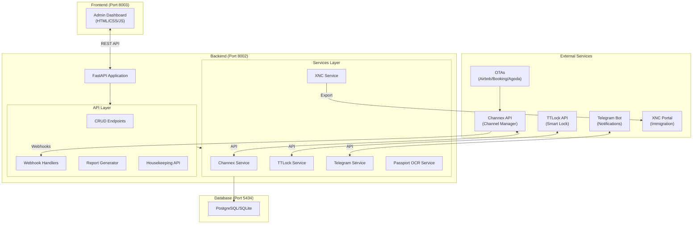
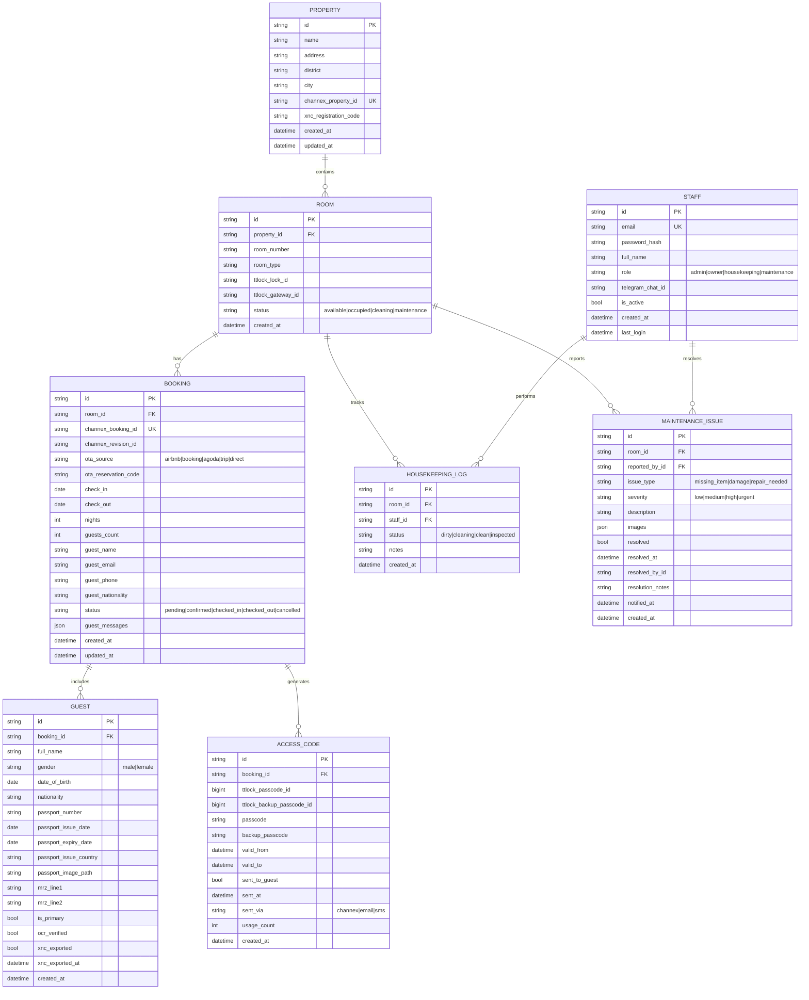
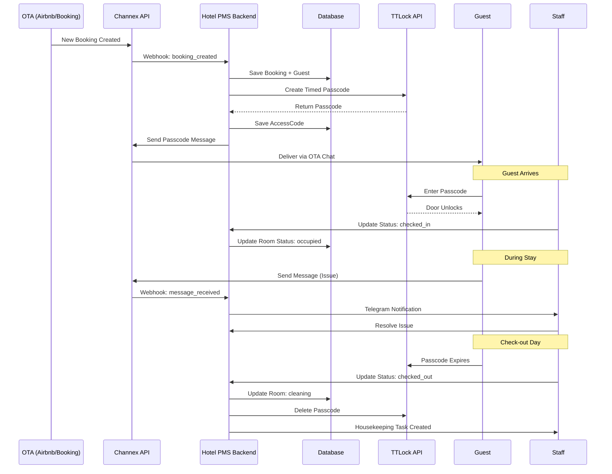
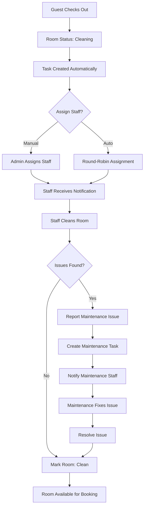
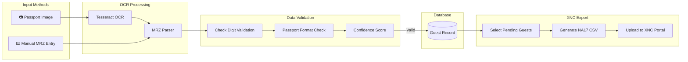
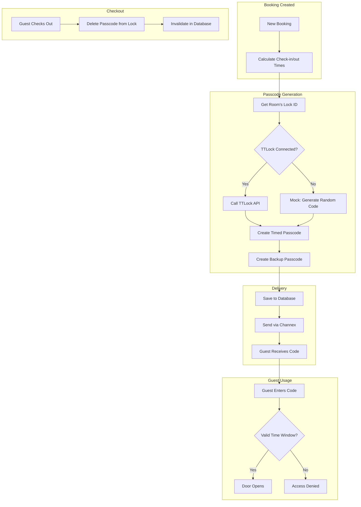

# 🏨 Hotel PMS - Property Management System

Hệ thống quản lý khách sạn/căn hộ dịch vụ tích hợp Channel Manager, Smart Lock và báo cáo XNC.

**Version:** 0.2.0  
**Status:** Development/Staging  
**Frontend URL:** https://hotel.khoviet.com  
**Backend Port:** 8002  
**Database Port:** 5434 (PostgreSQL)

---

## 🚀 Features Overview

### ✅ Production Ready Features

| Feature | Description |
|---------|-------------|
| **Admin Dashboard** | Modern dark theme UI with glassmorphism effects |
| **Booking Management** | View, filter, and manage bookings from all OTAs |
| **Room Status Grid** | Visual room management with one-click status updates |
| **Guest Management** | Guest records with passport info and XNC status |
| **Passport OCR** | MRZ parsing from passport Machine Readable Zone |
| **Housekeeping** | Task assignment, room status, maintenance tracking |
| **XNC Export** | NA17 format reports for immigration portal |
| **Mobile Responsive** | Full mobile/tablet support with touch-friendly UI |

### 🧪 Mock/Demo Features (Requires API Credentials)

| Feature | Description | Required |
|---------|-------------|----------|
| **Channex Sync** | Booking sync from Airbnb/Booking/Agoda/Trip | Channex API Key |
| **TTLock Integration** | Smart lock passcode generation | TTLock Hardware + Dev Account |
| **Telegram Notifications** | Instant alerts for bookings and issues | Telegram Bot Token |
| **Auto-Response** | Automated guest message replies | Channex Messaging API |

---

## 🏗️ System Architecture



---

## 📁 Project Structure (Accurate)

```
HOTEL/
├── 📄 .env.example                    # Environment variables template
├── 📄 .gitignore                      # Git ignore rules
├── 📄 CHANGELOG.md                    # Version history & feature status
├── 📄 README.md                       # This documentation
├── 📄 Dockerfile                      # Backend Docker image
├── 📄 docker-compose.production.yml   # Production Docker Compose
├── 📄 nginx_hotel.khoviet.com.conf    # Nginx site configuration
│
├── 📁 backend/
│   ├── 📄 alembic.ini                 # Alembic configuration
│   ├── 📄 requirements.txt            # Python dependencies
│   ├── 📄 init_db.py                  # Database seeding script
│   ├── 📄 standalone_demo.py          # Standalone demo script
│   ├── 📄 hotel_pms.db                # SQLite database (dev)
│   │
│   ├── 📁 alembic/                    # Database migrations
│   │   ├── 📄 env.py                  # Migration environment
│   │   ├── 📄 script.py.mako          # Migration template
│   │   └── 📁 versions/               # Migration files
│   │
│   └── 📁 app/                        # Main application
│       ├── 📄 __init__.py
│       ├── 📄 main.py                 # FastAPI app entry point
│       ├── 📄 config.py               # Settings from environment
│       ├── 📄 database.py             # SQLAlchemy setup
│       ├── 📄 demo.py                 # Demo data generator
│       │
│       ├── 📁 api/                    # API route handlers
│       │   ├── 📄 __init__.py         # Router exports
│       │   ├── 📄 health.py           # GET /health
│       │   ├── 📄 crud.py             # CRUD endpoints (13KB)
│       │   ├── 📄 bookings.py         # Booking operations
│       │   ├── 📄 rooms.py            # Room management
│       │   ├── 📄 passport.py         # Passport OCR (8.5KB)
│       │   ├── 📄 housekeeping.py     # Housekeeping API (13.5KB)
│       │   ├── 📄 reports.py          # XNC report generation
│       │   └── 📄 webhooks.py         # Channex webhooks (9KB)
│       │
│       ├── 📁 models/                 # SQLAlchemy ORM models
│       │   └── 📄 __init__.py         # All models (10.5KB)
│       │
│       ├── 📁 schemas/                # Pydantic schemas
│       │   └── 📄 __init__.py         # All schemas (6.8KB)
│       │
│       ├── 📁 services/               # Business logic
│       │   ├── 📄 __init__.py         # Service exports
│       │   ├── 📄 channex_service.py  # Channel Manager (9.4KB)
│       │   ├── 📄 ttlock_service.py   # Smart Lock API (11KB)
│       │   ├── 📄 xnc_service.py      # XNC NA17 export (13.5KB)
│       │   ├── 📄 telegram_service.py # Telegram stub (2KB)
│       │   ├── 📄 passport_ocr_service.py # MRZ parser (13.8KB)
│       │   └── 📄 mock_services.py    # Mock implementations (15KB)
│       │
│       └── 📁 tasks/                  # Celery tasks (optional)
│           └── 📄 __init__.py
│
├── 📁 frontend/
│   ├── 📄 index.html                  # Main HTML (20KB)
│   ├── 📄 app.js                      # JavaScript logic (65KB)
│   ├── 📄 styles.css                  # CSS styles (24KB)
│   ├── 📄 nginx.conf                  # Container Nginx config
│   └── 📄 Dockerfile                  # Frontend Docker image
│
├── 📁 docs/
│   ├── 📄 101-Mau A17.doc             # NA17 template reference
│   └── 📄 vps_rebuild_docker_backend.ps1
│
└── 📁 scripts/ (PowerShell deployment)
    ├── 📄 deploy_hotel_pms.ps1        # Main deployment script
    ├── 📄 deploy_and_test_hotel_pms.ps1
    ├── 📄 fix_deployment.ps1
    ├── 📄 fix_nginx_conflict.ps1
    ├── 📄 fix_nginx_routing.ps1
    ├── 📄 fix_ipv4_restart.ps1
    └── 📄 setup_vps_ssl.ps1
```

---

## 🗄️ Database Schema

### Entity Relationship Diagram



---

## 🔄 Workflow Diagrams

### 1. Booking Flow (OTA → Check-out)



### 2. Housekeeping Workflow



### 3. Passport OCR & XNC Export Flow



### 4. Smart Lock Integration Flow



---

## 🔌 API Endpoints Reference

### Health & Info
| Method | Endpoint | Description |
|--------|----------|-------------|
| GET | `/` | API info and version |
| GET | `/health` | Service health status |

### CRUD Operations
| Method | Endpoint | Description |
|--------|----------|-------------|
| GET | `/api/v1/crud/stats` | Dashboard statistics |
| GET | `/api/v1/crud/properties` | List properties |
| GET | `/api/v1/crud/rooms` | List rooms |
| PUT | `/api/v1/crud/rooms/{id}/status` | Update room status |
| GET | `/api/v1/crud/bookings` | List bookings (filterable) |
| GET | `/api/v1/crud/bookings/{id}` | Booking details |
| POST | `/api/v1/crud/bookings` | Create booking |
| PUT | `/api/v1/crud/bookings/{id}/status` | Update booking status |
| POST | `/api/v1/crud/bookings/{id}/generate-passcode` | Generate lock passcode |
| GET | `/api/v1/crud/guests` | List guests |
| GET | `/api/v1/crud/locks` | List smart locks |

### Passport OCR
| Method | Endpoint | Description |
|--------|----------|-------------|
| POST | `/api/v1/passport/parse-mrz` | Parse MRZ text |
| POST | `/api/v1/passport/parse-image` | Parse passport image |
| POST | `/api/v1/passport/demo` | Demo with sample MRZ |

### Housekeeping
| Method | Endpoint | Description |
|--------|----------|-------------|
| GET | `/api/v1/housekeeping/tasks` | List cleaning tasks |
| POST | `/api/v1/housekeeping/tasks` | Create task |
| PUT | `/api/v1/housekeeping/tasks/{id}` | Update task |
| GET | `/api/v1/housekeeping/issues` | List maintenance issues |
| POST | `/api/v1/housekeeping/issues` | Report issue |
| PUT | `/api/v1/housekeeping/issues/{id}` | Update/resolve issue |
| GET | `/api/v1/housekeeping/rooms/{id}/status` | Get room cleaning status |
| PUT | `/api/v1/housekeeping/rooms/{id}/status` | Update room status |
| GET | `/api/v1/housekeeping/staff` | List staff |

### Reports
| Method | Endpoint | Description |
|--------|----------|-------------|
| POST | `/api/v1/reports/xnc/generate` | Generate XNC NA17 report |
| GET | `/api/v1/reports/xnc/pending` | Pending guests count |

### Webhooks
| Method | Endpoint | Description |
|--------|----------|-------------|
| POST | `/api/v1/webhooks/channex` | Channex booking webhook |
| POST | `/api/v1/webhooks/channex/message` | Channex message webhook |

---

## 🛠️ Setup Guide

### Prerequisites
- Python 3.11+
- PostgreSQL 15+ (production) or SQLite (development)
- Tesseract OCR (optional, for passport image scanning)

### Quick Start

```bash
# 1. Clone & Setup
cd d:\HOTEL
python -m venv venv
.\venv\Scripts\activate
pip install -r backend/requirements.txt

# 2. Configure environment
copy .env.example .env
# Edit .env with your values

# 3. Initialize database
cd backend
python init_db.py

# 4. Start backend
uvicorn app.main:app --reload --host 0.0.0.0 --port 8002

# 5. Access application
# Frontend: http://localhost:8003
# API Docs: http://localhost:8002/docs
```

### Docker Deployment

```bash
docker-compose -f docker-compose.production.yml up -d --build
```

---

## 📊 Feature Status Legend

| Icon | Status | Description |
|------|--------|-------------|
| ✅ | Production | Works without additional setup |
| ⚠️ | Partial | Works but requires optional dependency |
| 🧪 | Mock | Demo mode, needs real API credentials |
| 📝 | Stub | Placeholder, needs implementation |
| 🔮 | Planned | On roadmap, not yet started |

---

## 📝 License

Private - All Rights Reserved

---

## 👥 Contact & Support

For issues and feature requests, please create an issue in the repository.
